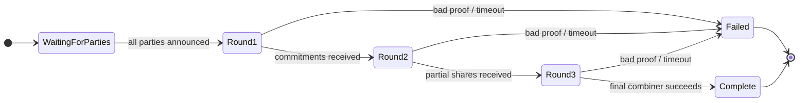

# Code Tour for Auditors

This is a fast-track map of the Horcrux codebase for security reviewers.
It tells you *where the interesting code lives* so you can focus your time
on trust-boundary crossings and cryptographic primitives rather than UI
plumbing.

Read this alongside [`security-model.md`](security-model.md) — the former
describes *what* we protect and *how*, this doc tells you *where* to look.

---

## 1. High-level layout

```
/
├── horcrux-core/          Rust crate — MPC, crypto, chain builders, FFI
│   └── src/
│       ├── ffi.rs                ── UniFFI boundary (ALL host ↔ Rust calls)
│       ├── mpc/
│       │   ├── session.rs        ── SessionManager (ceremony lifecycle)
│       │   ├── keygen.rs         ── DKG (CGGMP21 / FROST)
│       │   ├── signing.rs        ── Signing (CGGMP21 / FROST)
│       │   ├── refresh.rs        ── Key refresh (CGGMP21 key_refresh)
│       │   └── prime_pool.rs     ── Pre-generated safe primes for CGGMP21
│       ├── shard/
│       │   └── crypto.rs         ── HKDF + AES-256-GCM shard encryption
│       ├── chain/                ── EVM / Bitcoin / Solana tx builders
│       └── e2e/                  ── Noise protocol session wrappers
│
├── horcrux-relay/         Rust crate — zero-knowledge WebSocket relay
│   └── src/server.rs             ── Room routing, no ciphertext access
│
├── ios/
│   └── Horcrux/
│       ├── Security/
│       │   ├── SecureEnclaveManager.swift   ── P-256 SE wrap / unwrap
│       │   ├── SecureKeyVault.swift         ── SWK (Shard Wrap Key) vault
│       │   ├── KeychainManager.swift        ── Keychain primitives
│       │   ├── CertificatePinner.swift      ── WSS pinning
│       │   └── PortableBackupCrypto.swift   ── QR/cloud backup encryption
│       ├── Core/HorcruxBridge.swift         ── UniFFI wrapper (Swift side)
│       ├── Features/                        ── UI — not security-critical
│       └── App/AppState.swift               ── Unlock / PIN / lifecycle
│
└── uniffi-bindgen/        UniFFI binding generator driver
```

---

## 2. Trust boundaries

The review should give disproportionate attention to **boundary crossings**
where data is passed between principals with different trust levels.

| Boundary                     | Where to look                                        |
|------------------------------|------------------------------------------------------|
| User → iOS app (touch input) | `ios/Horcrux/Features/**/*ViewModel.swift`           |
| iOS app → Rust core (FFI)    | `horcrux-core/src/ffi.rs` ← **15 entry points**      |
| Rust core → Keychain (host)  | via `horcrux_encrypt_shard` / `horcrux_decrypt_shard`|
| iOS app → Secure Enclave     | `SecureEnclaveManager.seal` / `.open`                |
| Device ↔ Device (Noise E2E)  | `horcrux-core/src/e2e/` + `Horcrux/Network/`         |
| App ↔ Relay (WSS)            | `horcrux-relay/src/server.rs`                        |
| Relay ↔ Internet (unsafe)    | TLS termination in prod deploy                       |

**Key invariant**: the relay never sees plaintext. Every MPC message is
Noise-encrypted end-to-end between peer devices. Kudelski-audited
CGGMP21 and RFC 9591 FROST both provide identifiable abort, so any party
that deviates from protocol is detectable and traceable.

---

## 3. The FFI surface (17 functions)

Everything the iOS app can ask the Rust core to do lives in one file:
[`horcrux-core/src/ffi.rs`](../horcrux-core/src/ffi.rs). Each function is
annotated with `#[uniffi::export]` so auto-generated Swift bindings are a
byte-for-byte match. The categories:

| Category            | Functions                                                              |
|---------------------|------------------------------------------------------------------------|
| Address derivation  | `horcrux_evm_address`, `horcrux_btc_address`, `horcrux_solana_address` |
| Hashing             | `horcrux_keccak256`                                                    |
| Prime pool (CGGMP21)| `horcrux_prime_pool_init`, `_count`, `_generate_one`                   |
| Shard at rest       | `horcrux_encrypt_shard`, `horcrux_decrypt_shard`                       |
| E2E keys / tokens   | `horcrux_generate_noise_keypair`, `horcrux_generate_session_token`     |
| Tx construction     | `horcrux_build_evm_transaction`, `_btc_transaction`, `_solana_transaction` |
| MPC ceremonies      | SessionManager methods (exposed on an object, not as free fns)         |

Two FFI entry points are cryptographically sensitive:

- **`horcrux_encrypt_shard(plaintext, device_key, pin)`** — despite the
  parameter name, `pin` on iOS is the **SWK** (Shard Wrap Key), not the
  user's numeric PIN. ABI-stable name kept for existing Swift callers.
  KDF is `HKDF-SHA256(ikm = device_key ‖ pin, salt = random 16 B,
  info = b"horcrux-shard-encryption")`. AES-256-GCM with a fresh 12 B
  nonce. See [`shard/crypto.rs`](../horcrux-core/src/shard/crypto.rs).

- **SessionManager methods** — drive the MPC state machine. Each
  ceremony owns a `KeygenState` or `SigningState` enum; state
  transitions are strictly serial, one message at a time.

---

## 4. Ceremony state machines



- **Keygen** goes through all three rounds
  ([`keygen.rs:59`](../horcrux-core/src/mpc/keygen.rs#L59)).
- **Signing** collapses to two rounds for FROST
  ([`signing.rs:64`](../horcrux-core/src/mpc/signing.rs#L64));
  CGGMP21 signing reuses precomputed auxiliary data but never
  pre-signatures (nonce-reuse attack surface is eliminated — see
  `security-model.md` §"Attack Scenarios — Nonce Reuse").
- A ceremony that enters `Failed` cannot be restarted; a fresh
  `SessionManager::create_*` call creates a new session with a new id.

---

## 5. Where to spend the first hour

If you only have 60 minutes, read these files in order:

1. [`SECURITY.md`](../SECURITY.md) — disclosure policy and scope.
2. [`docs/security-model.md`](security-model.md) — threat model, crypto
   choices, defense-in-depth layers.
3. [`horcrux-core/src/ffi.rs`](../horcrux-core/src/ffi.rs) — every
   privilege boundary crossing between iOS and Rust.
4. [`horcrux-core/src/shard/crypto.rs`](../horcrux-core/src/shard/crypto.rs)
   — actual AEAD primitive + HKDF wrapper.
5. [`ios/Horcrux/Security/SecureKeyVault.swift`](../ios/Horcrux/Security/SecureKeyVault.swift)
   — PIN- and Face-ID-wrapped SWK flows.
6. [`ios/Horcrux/Security/SecureEnclaveManager.swift`](../ios/Horcrux/Security/SecureEnclaveManager.swift)
   — ECIES seal / open using the SE P-256 key.
7. [`horcrux-core/src/mpc/signing.rs`](../horcrux-core/src/mpc/signing.rs)
   and [`keygen.rs`](../horcrux-core/src/mpc/keygen.rs) — state
   machines and invariants.
8. [`horcrux-relay/src/server.rs`](../horcrux-relay/src/server.rs) —
   zero-knowledge room routing; confirm no plaintext crosses this code.

---

## 6. Reproducible builds

- `cargo build -p horcrux-core --release` — host toolchain, deterministic.
- `ios/build-rust.sh` — cross-compiles the core for all iOS targets. Has
  a toolchain-fingerprint guard so a mid-review `rustup update` can't
  silently produce a different artefact.
- Dependency pinning lives in `Cargo.lock` (committed). Run
  `cargo audit` to check the advisory database — the ignore list in
  `.github/workflows/ci.yml` documents each accepted RUSTSEC entry
  with rationale.
- `cargo deny check` (CI: `.github/workflows/cargo-deny.yml`) is the
  supply-chain gate — `advisories`, `licenses`, `bans`, `sources` all
  run on every push + weekly cron.

---

## 7. Fuzzing & property tests

Coverage-guided fuzz targets live in [`horcrux-core/fuzz/`](../horcrux-core/fuzz/)
with four entry points, each paired with a matching fast-CI proptest:

| Fuzz target | Proptest | Threat |
|---|---|---|
| `evm_calldata` | `chain::evm::prop_tests::prop_decode_evm_calldata_never_panics` | UI previews attacker-supplied tx calldata |
| `shard_decrypt` | `shard::crypto::prop_tests::{prop_roundtrip_any_inputs, prop_wrong_pin_rejected}` | Malformed backup import |
| `noise_handshake` | `transport::e2e::prop_tests::prop_read_handshake_never_panics` | Network-delivered handshake bytes |
| `mpc_payload` | `mpc::prop_tests` (9 parsers: Schnorr + Feldman DKG + FROST + CGGMP21) | Peer-delivered MPC wire payloads during keygen/signing |

Proptests (256–512 cases each) run under every `cargo test`; the fuzz
targets require `cargo install cargo-fuzz` + `rustup toolchain install
nightly` and are meant for long-running exploration. See
[`horcrux-core/fuzz/README.md`](../horcrux-core/fuzz/README.md).

---

## 8. Intentionally out of scope

- **dApp browser / WalletConnect / EIP-712 typed-data signing** —
  round 18 retirement. Horcrux only signs raw transfer transactions
  whose digest is computed from the canonical chain-specific pre-image
  (EVM RLP → keccak256, Bitcoin sighash, Solana message). See
  [`security-audit-2026-04.md`](security-audit-2026-04.md) §H8.
- **Server-side key material** — the relay is zero-knowledge by
  construction (see `horcrux-relay/src/server.rs`). If you find a
  code path where the server touches plaintext, that's a bug.

---

## 9. Known limitations

- **iOS simulator tests** run under the `targetEnvironment(simulator)`
  flag skip SE-specific paths because the simulator doesn't provide a
  Secure Enclave. These paths are exercised on physical devices only;
  see `SecureEnclaveManagerTests.swift` for the bounds of simulator
  coverage.
- **Android port** not yet shipped — the threat model assumes iOS.
  StrongBox parity will mirror the SE flow.
- **Formal audit** is pending — this repo is pre-audit.

Questions? Please open a private advisory via the channels in
[`SECURITY.md`](../SECURITY.md). Non-sensitive clarifications can
become a normal GitHub discussion.
